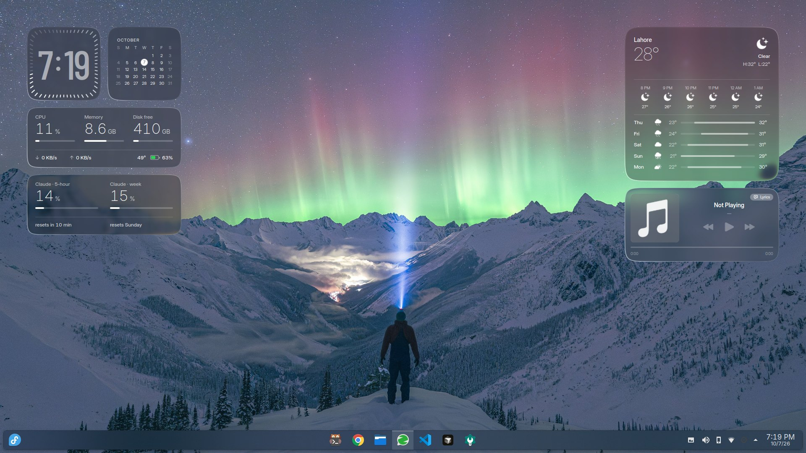
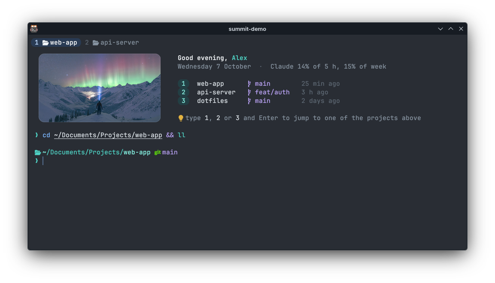

# Summit desktop

A fast, glassy KDE Plasma 6 desktop and terminal setup for Fedora. Everything is user-level (no root),
re-runnable, and measured: a new terminal shows its prompt in about 5 ms.





## What you get

**Desktop**
- Glass widgets: clock, calendar, weather and music from [Liquid Glass](https://github.com/jaxparrow07/liquidglass-kde-widgets)
  (with fixes, see below), plus three new ones in the same style:
  - **Vitals**: CPU, memory, free disk, network, temperature and battery;
  - **Claude Usage**: your Claude Code 5-hour and weekly limits (needs the status line below);
  - **Wallpapers** (panel): a gallery of your library plus a *Discover* tab that keeps loading
    top-rated photos from Wallhaven at your screen's resolution (4K minimum). Scroll on the icon to
    cycle wallpapers, middle-click for a random one.
- **Accent colour follows the wallpaper.** Each switch picks a colour from the photo (OKLab k-means,
  scored like Material You, checked for WCAG contrast against the interface) and applies it to
  Plasma and to kitty.
- **Summit Glass** Plasma style: the stock style with a see-through, blurred panel.
- Summit colour scheme (slate graphite, teal), Papirus icons with teal folders, Bibata cursor, Inter
  and JetBrains Mono.

**Terminal** ([kitty](https://sw.kovidgoyal.net/kitty/) + zsh)
- Welcome card in each new window: the current wallpaper, a greeting, your three most recent
  projects (type `1`, `2` or `3` to jump there) and a tip. Pure zsh, about 2 ms.
- Powerlevel10k with instant and transient prompt, fuzzy Tab completion with previews (fzf-tab),
  atuin history on `Ctrl+R`, zoxide `cd`, autosuggestions and syntax highlighting.
- Tabs with per-program icons, rounded split panes, instant "did you mean" for typos.
- Summit themes for bat, delta (`git diff`), lazygit, yazi, btop, tmux, eza, nano, fastfetch,
  tldr, glow, fzf, Neovim, KWrite/Kate, and a **Summit theme for VS Code and Cursor**.
- Type `keys` for a one-page reference of every shortcut.

**Speed work you get for free** (each measured on the original machine)
- Fedora's command-not-found handler (about 4 s per typo) replaced by an instant one.
- `/etc/profile.d` is not re-run for every terminal (about 150 ms).
- atuin writes through its daemon (6 ms instead of up to 80 ms per command).
- mise's per-prompt check stays on its fast path (2 ms instead of 10 ms).

## Just the pieces, from the KDE Store

Each of these installs from Plasma's own "Get New…" buttons and works without the rest of the setup:

| | where in Plasma |
|---|---|
| **Summit Vitals**, **Summit Claude Usage** | right-click desktop › Add Widgets › Get New Widgets |
| **Summit Wallpapers** (panel gallery, accent from wallpaper) | the same, then add it to your panel |
| **Summit** colour scheme | System Settings › Colours › Get New |
| **Summit Glass** Plasma style | System Settings › Plasma Style › Get New |

Search for "Summit" in those dialogs. The files are also attached to each
[GitHub release](https://github.com/VicegerentPrince/summit-desktop/releases), and `store/build.sh` builds them.

## Install the whole setup

Fedora 44, KDE Plasma 6.7, Wayland. Other distributions should work with their own package names,
but have not been tested.

```sh
# packages (the only step that needs root)
sudo dnf install -y zsh git gh curl fzf bat eza zoxide btop tmux nano neovim fastfetch \
  zsh-autosuggestions zsh-syntax-highlighting python3-pillow \
  papirus-icon-theme rsms-inter-fonts jetbrains-mono-fonts kitty-terminfo

git clone https://github.com/VicegerentPrince/summit-desktop ~/.local/share/summit-desktop
cd ~/.local/share/summit-desktop
./install.sh --layout                        # --layout places the desktop widgets
wall fetch -n 12                             # a first batch of wallpapers
chsh -s /usr/bin/zsh                         # optional: zsh as your login shell
```

Then log out and back in once. The Bibata cursor is used if `bibata-cursor-theme` is installed.

- **Weather location:** `SUMMIT_WEATHER="Berlin:52.52:13.405" ./install.sh --layout`
- **Claude usage widget:** add the status line to `~/.claude/settings.json`:
  `"statusLine": { "type": "command", "command": "~/.claude/statusline.sh", "padding": 0 }`
- **Welcome card projects** are read from `~/Documents/Projects`. `welcome off` hides the card.

Every file the installer would overwrite is first copied to `~/.local/state/summit/backup-<time>/`.
`./install.sh` is safe to run again; it changes nothing that is already right.

## Commands

| | |
|---|---|
| `wall next` / `prev` / `random` | switch wallpaper (desktop, lock screen, accent, welcome card) |
| `wall fetch -n 8 aurora` | download more photos from Wallhaven |
| `wall accent on` / `off` | let the accent follow the wallpaper, or put your scheme's own back |
| `wall accent` | re-pick the accent after changing the wallpaper some other way |
| `welcome` | show the welcome card again |
| `keys` | every shortcut on one page |
| `y`, `lg`, `lzd` | file manager, git, docker |

## Layout

| folder | what |
|---|---|
| `install.sh`, `fetch.sh` | installer and downloads (kitty, zsh plugins, mise tools, Liquid Glass) |
| `home/` | dotfiles, installed to the same paths under `~` |
| `look/` | colour scheme, icons, cursor, fonts |
| `plasma-style/` | the Summit Glass panel |
| `widgets/`, `widgets-panel/` | the widgets (`assemble.sh` builds them) and the patches to Liquid Glass |
| `store/` | `build.sh` for the KDE Store files, the listings (`STORE.md`) and their images |
| `tools/`, `syntax/` | themes for the CLI tools and editors |
| `vscode/` | the VS Code / Cursor theme and the scripts that build and check it |
| `extras/` | optional, hardware-specific fixes (a WirePlumber rule for the Redragon GM303 microphone) |

## Changes to Liquid Glass

Applied at install time to a pinned upstream commit (`widgets/liquidglass.sh`, `patch_glass.py`):
the clock redraws once a second instead of 60 times (it used 23% of a CPU core); the music widget
updates once a second, fetches lyrics only when shown, and its play/pause works with KDE Connect
players; the glass no longer turns black after a shell restart or goes stale when the wallpaper
changes; a few QML warnings fixed; Inter replaces the bundled Apple fonts; the "no album"
placeholder takes the glass colour.

## Credits and licence

- **Liquid Glass** by Jack Faith ([jaxparrow07](https://github.com/jaxparrow07/liquidglass-kde-widgets)), GPL-3.0:
  the clock, calendar, weather and music widgets, and the glass effect that Vitals and Claude
  Usage are drawn with. His widgets are also on the KDE Store. If you like the look, support him on
  [Ko-fi](https://ko-fi.com/devrinth).
- Wallpapers are not included; `wall` downloads them from [Wallhaven](https://wallhaven.cc), where
  each photo belongs to its author.
- Breeze (the base of Summit Glass) by the KDE Visual Design Group.

This project is released under the GNU General Public License v3.0, see [LICENSE](LICENSE).
